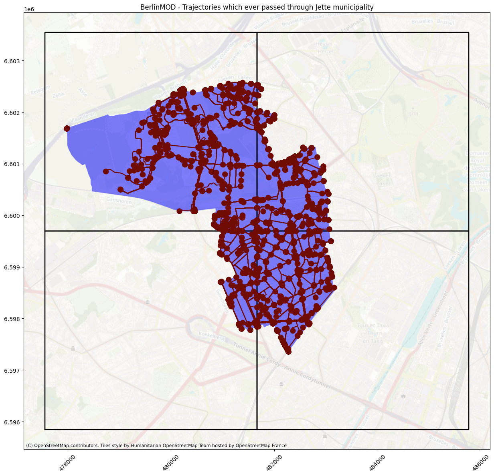
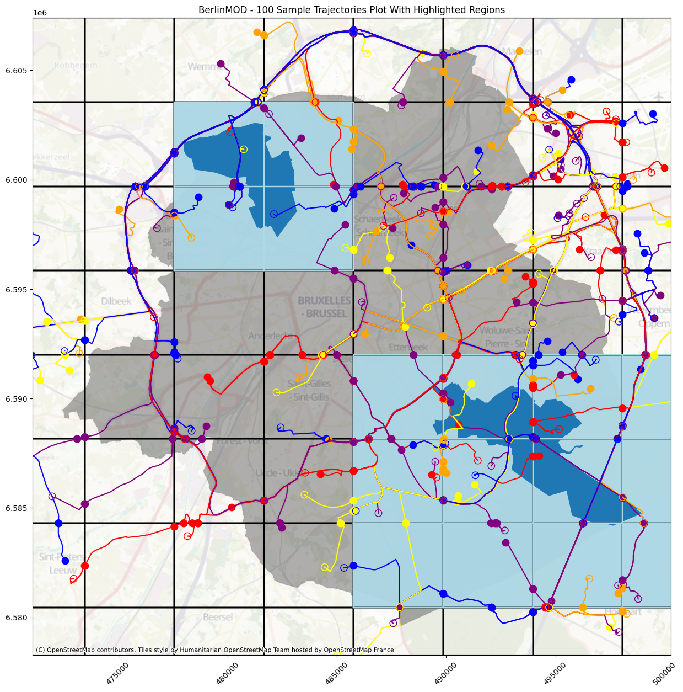

# MobilitySpark
***
Repository to extend support of MEOS and MobilityDB data types into Pyspark, and experimentation on different partition techniques for trajectory data.
This repository was used as codebase for the thesis "MobilitySpark: Big Mobility Data Management with PySpark and PyMEOS".

To cite this project, please use:

```
León, L. (2024). MobilitySpark: Big Mobility Data Management with PySpark and PyMEOS (Master’s thesis). University of Padova and Université Libre de Bruxelles.
```

To review the experimental results obtained in the thesis, please go to the */experiments* folder.

## Install

### Through Docker

The project can be run locally using Docker. This method is preferred if you have a
Mac with M-Series Chip.

1. Download this repository.
2. <code>cd</code> into the *container* folder.
3. Build the image, name it as you prefer, for example *mobilityspark*:

```bash
docker build -t <LOCAL-NAME-OF-THE-IMAGE> <PATH-TO-Dockerfile>
```

Example:

```bash
docker build -t mobilityspark ./
```

4. Run the container:

```bash
docker run -v <VOLUME-PATH> -p <JUPYTERLAB-PORT-FORWARD> -p <SPARK-UI-PORT-FORWARD> <CONTAINER-NAME>
```

Example:

```bash
docker run -v $(pwd)/../../../data:/data -p 8887:8888 -p 4040:4040 -p 4041:4041 -p 4042:4042 pyrtitionfinal
```

This example, for instance, runs the project mapping the volume ../../../data to the /data folder inside the container.
This is useful if you want to use local files inside your container. Also, you need to specify:
- Ports for the JupyterLab (recommended <code>-p 8887:8888 </code>)
- Ports for the Spark UI (recommended <code>-p 4040:4040 </code>)

You can reserve any number of ports for different Spark sessions, as in the example.

This command will run the container and will end up by printing a token to start the JupyterLab. Copy the token.

5. Go to your browser, and go to localhost:8887, or the port corresponding to your JupyterLab.
6. Insert the generated token where asked. The JupyterLab will prompt.
7. Now you can run the notebooks of the project by going to /notebooks inside the JupyterLab.


Overall the commands to install through Docker could be as follows:

```bash
# Clone first the repo and checkout to the latest tag.
git clone https://github.com/Action52/MobilityPySpark
git checkout v0.1.1

cd MobilityPySpark

# Build the image
docker build -t mobilityspark ./

# Run the container
docker run -v $(pwd)/../../../data:/data -p 8887:8888 -p 4040:4040 -p 4041:4041 -p 4042:4042 pyrtitionfinal

# Here you can optionally access the container directly through the console, or through the JupyterLab instance (recommended)
docker exec -it mobilityspark /bin/bash

# Run script or notebook with MobilitySpark
```

### Locally

To install locally:

1. Download this repository.
2. <code>cd</code> into the main folder of the repository.
3. In a clean Python environment, run:

```bash
pip install .
```

This will install MobilitySpark and the required packages in your environment.

4. If you desire to run the notebooks, now you can do, with your env activated:
```bash
jupyter notebook
```

5. Now you can run the notebooks of the project by going to /notebooks inside your local Jupyter server.

Overall, the commands to install locally could be as follows:

```bash
# Use a clean environment
conda create --name mobilitypyspark python=3.9
conda activate mobilitypyspark

# Clone the repository and checkout to the latest tag
git clone https://github.com/Action52/MobilityPySpark
cd MobilityPySpark
git checkout tags/v0.1.1

# Install the package
pip install .

# Run script or notebook with MobilitySpark
```

## Examples

There are three example notebooks located at the <code>/notebooks/</code> folder:
1. *UDTDemo.ipynb* - Provides an introduction to MobilitySpark, partitioning mobility data, and reading/writing these files using PySpark.
2. *PartitioningSchemesWithPyMEOS.ipynb* - Recreates the OpenSky experiments performed in the thesis using a sample dataset.
3. *BerlinMODQueries.ipynb* - Recreates the BerlinMOD experiments performed in the thesis using a sample dataset.

## Usage

Please refer to the examples section for a more detailed introduction to MobilitySpark, particularly *UDTDemo.ipynb*.

### Initiating a MobilitySpark application

This is started as any PySpark application. The only extra detail is calling the *pymeos_initialize*, *udt_append* and *register_udfs_under_spark_sql* methods.

```python
from pymeos import *

from pyspark.sql import SparkSession
from pyspark.sql.types import *
import pyspark.sql.functions as F

from pysparkmeos.UDT.MeosDatatype import *
from pysparkmeos.utils.udt_appender import udt_append
from pysparkmeos.utils.utils import *
from pysparkmeos.UDF.udf import *
from pysparkmeos.partitions.grid_partitioner import GridPartition
from pysparkmeos.UDTF.base_partition_udtf import BasePartitionUDTF

# Initialize PyMEOS
pymeos_initialize("UTC")

# Initialize a Spark session
spark = SparkSession.builder \
    .appName("PySpark UDT Example with PyMEOS") \
    .master("local[*]")
    .getOrCreate()

# Append the UDT mapping to the PyMEOS classes
udt_append()

# Register the UDFs in spark
register_udfs_under_spark_sql(spark)
```

### Declaring a schema with MobilitySpark Data Type

Schema management is important. If your input dataset already contains MEOS data in *well-known text (wkt)* format, Spark can read the dataset and directly process it as mobility data type.

```python
schema = StructType([
    StructField("icao24", StringType()),
    StructField("Point", TGeomPointInstUDT())  
])
df = spark.read.csv(data_path, header=True, schema=schema, mode='PERMISSIVE')
```

### Defining a User-Defined Type
Users may add extra MEOS data types. A way to do it is inheriting from *MeosDatatype*.

```python
class TBoolInstWrap(TBoolInst):
    def __setstate__(self, state):
        pymeos_initialize()
        self._inner = TBoolInst(state)._inner

    def __getstate__(self):
        pymeos_initialize()
        return self.__str__()

class TBoolInstUDT(MeosDatatypeUDT[TBoolInstWrap]):
    def simpleString(self) -> str:
        return "tinstant"

    def from_string(self, datum: str) -> TBoolInstWrap:
        return TBoolInstWrap(datum)
```

Finally, use monkey patching in your notebook to relate the UDT with the PyMEOS class:

```python
TBoolInst.__UDT__ = TBoolInstUDT()
```

### Calculating the Spatiotemporal Bounds of a Dataset

A common and essential task to handle and properly partition mobility data, is calculating the bounds of the dataset. MobilitySpark provides a straighforward MapReduce approach to calculate the bounds of the dataset. This method is actually very quick to use even with large datasets. These map and reduce functions can be accessed from the Utilities module.

```python
bounds = df.rdd \
    .mapPartitions(lambda x: bounds_calculate_map(x, colname='Point')) \
    .reduce(bounds_calculate_reduce)
```

### Calling a MobilitySpark User-Defined Function

Most of the times, operations on PyMEOS data columns will be executed with UDF's.

```python
df = df.withColumn("STBox", point_to_stbox("Point"))
```

### Defining a User-Defined Function
Users may define extra UDFs according to the use case scenario. **Always** initialize PyMEOS inside the UDF. This is because PySpark distribution triggers PyMEOS across multiple nodes, where it needs to be initialized each time.

```python
@F.udf(returnType=STBoxUDT())
def point_to_stbox(tpoint: TPoint, utc="UTC")
    pymeos_initialize(utc)
    return tpoint.bounding_box()
```

To be accessible through Spark SQL, register the function. Also save the dataframe as a view to make it accessible through Spark SQL:

```python
spark.udf.register("point_to_stbox", point_to_stbox)
df.createOrReplaceTempView("df")
spark.sql("SELECT point_to_stbox(point) FROM df")
```

### Defining a UDTF

User-defined table functions are quite useful as generator functions based on existing data. They require a predefined output schema. This example "explodes" a trajectory column into its instant values and registers the UDTF.

```python
# Materialize Instants in dataframe
@F.udtf(returnType=StructType([
    StructField("seqId", IntegerType()),
    StructField("instant", TGeomPointInstUDT()),
    StructField("x", DoubleType()),
    StructField("y", DoubleType()),
    StructField("z", DoubleType()),
    StructField("t", TimestampType())
]))
class InstantsUDTF:
    def eval(self, row, utc="UTC"):
        pymeos_initialize(utc)
        instants = row.movingobject.instants()
        for instant in instants:
            z = None
            if instant.has_z():
                z = instant.z().start_value()
            yield row.trajectory_id, TGeomPointInstWrap(instant.__str__()), instant.x().start_value(), instant.y().start_value(), z, instant.start_timestamp()

spark.udtf.register("InstantsUDTF", InstantsUDTF)
```

### Calling a UDTF

To call a registered UDTF, the user may require to leverage Spark SQL. Here, trajectories is a dataset containing PyMEOS TGeomPointSeq data. Note how we rename the 'PointSeq' column to 'movingobject' as it is required by the UDTF definition:

```python
instants = spark.sql(f"""
        SELECT * 
        FROM InstantsUDTF(
            TABLE(
                    SELECT 
                        seqId AS trajectory_id,
                        PointSeq AS movingobject
                    FROM trajectories
            )
        )

""")
```

### Defining a Partitioner

The Partitioning module is the core module in MobilitySpark. The included Partitioners are Regular Grid, KD-Tree, Adaptive Bins, and Bisective K-Means. To create a custom partitioner, simply inherit from *MobiliyPartitioner*:

```python
class CustomPartitioner(MobilityPartitioner):
    """
    Class to partition mobility data.
    """

    def __init__(
        self, bounds, **kwargs
    ):
        self.grid = [tile for tile in self._generate_grid(bounds, **kwargs)]
        self.tilesstr = [tile.__str__() for tile in self.grid] # Required to interact with Spark
        self.numPartitions = len(self.tilesstr)
        super().__init__(self.numPartitions, self.get_partition)

    @staticmethod
    def _generate_grid(
        bounds: STBox,
        **kwargs
    ):
        pymeos_initialize(kwargs['utc'])
        # Implement partitioning behavior
        tiles = []
        return tiles

    def num_partitions(self) -> int:
        """Return the total number of partitions."""
        return self.numPartitions
```

### Calling a Partitioner

Calling a Partitioner with MobilitySpark is straightforward:

```python
# Regular Grid
gp = GridPartition(bounds=bounds, cells_per_side=3)
grid = gp.as_spark_table() # Saves it in Spark
grid.cache()
grid.createOrReplaceTempView("RegularGrid")
gp.plot() # Plots the grid
```

### Defining a UDTF with BasePartitionUDTF

MobilitySpark provides a *BasePartitionUDTF* class to generalize the UDTF generation with Mobility data and a Partitioner. Example:

```python
schema = StructType([
        StructField("instantid", IntegerType()),
        StructField("tileid", IntegerType()),
        StructField("instant", TBoolInstUDT())])

@F.udtf(returnType=schema)
class InstantsUDTF(BasePartitionUDTF):
    def __init__(self):
        check_function = lambda instant, tile: instant.temporally_overlaps(tile)
        super().__init__(
            response_extra_cols=[], check_function=check_function, return_full_traj=True
        )

    def eval(self, row: Row):
        for val in super().eval_wrap(row):
            yield val
```

Here, the output schema contains 3 columns, but the user may add more as needed. The *check_function* parameter allows to use any lambda function as checker to see if the trajectory or instant is at the tile. Here, for instance, the function used is *temporally_overlaps*. The user may also define is the trajectory should be partitioned or not, as well as the names of the extra columns to process and append.

### Calling a UDTF defined with BasePartitionUDTF

Assuming the existance of a instants table and a grid table, it can be used as:

```python
spark.sql("""
    SELECT * 
    FROM InstantsUDTF(
        TABLE(
                SELECT 
                    instantid AS trajectory_id,
                    tboolinst_from_base_time(instant, TRUE) AS movingobject, 
                    (SELECT collect_list(tile) FROM grid) AS tiles, 
                    (SELECT collect_list(tileid) FROM grid) AS tileids
                FROM instantsRawNoCache
        )
    )
""")
```

## Sample plots





Copyright (c) 2024, see LICENSE
